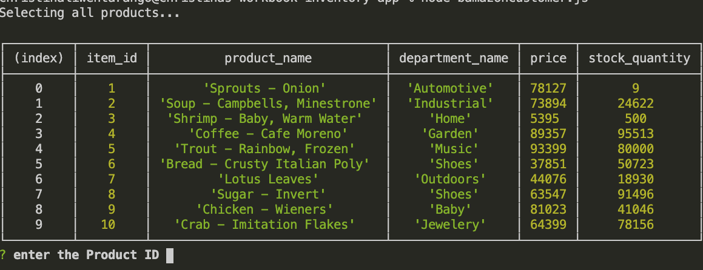
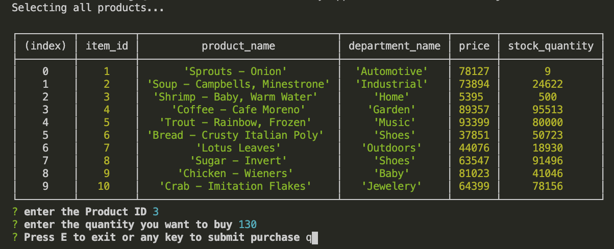
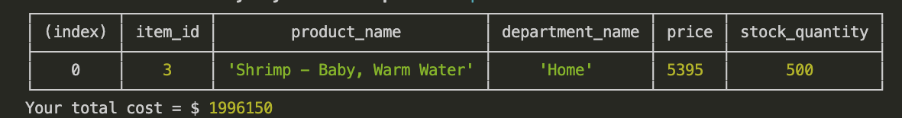
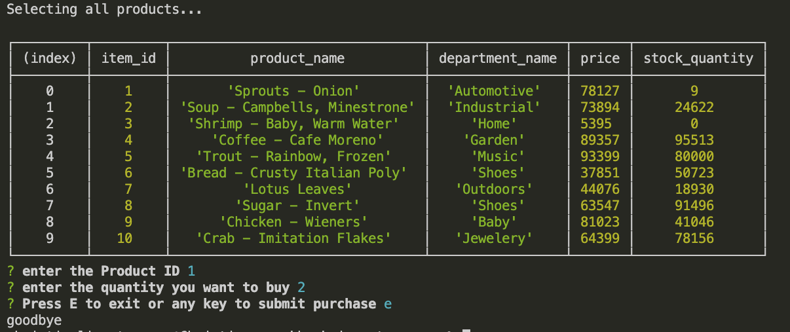

##Inventory App - Customer

*As a customer, you can view a list of product and sequently places an order using item id with specific quantity. 

*We will first check if there are enough inventory on hand to fulfill your order

*If we do not have enough, please adjust your order quantity

*If we do have enough on hand quantity to fulfill, please submit your purchase order with any key but E (E will exit the program)

*Each time your order is placed, we will let you know the total running cost of all the items you are willing to purchase and we can fulfill

*Exit the main program when you are done with shopping!

**Enjoy!
